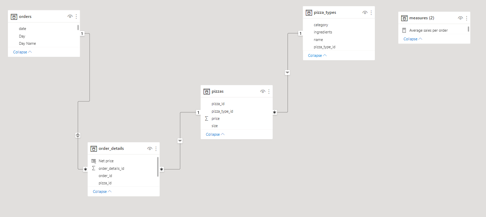
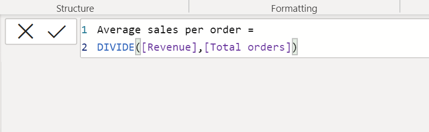
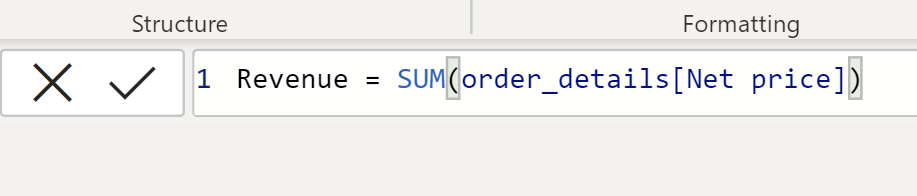
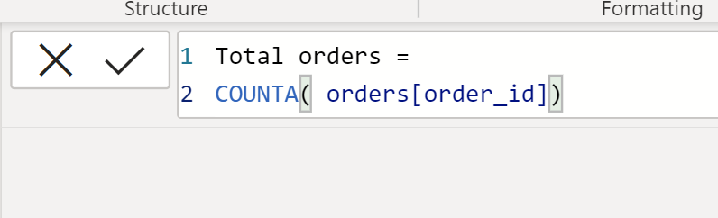

# Plato's-Pizza-Analysis

## Introduction
Pizza is one of the most topmost liked fast food in the world. Many businesses including Plato Pizza invest to provide affordable pizza with great taste and customer satisfaction. Data and information is the most strategic assist of a business, the underlying challenges that business have is understanding and using their data to positively affect changes within the business. Today retail business amass huge amount of data to provide insight and better decision making that foster business growth and development. So its safe to say that data is considered as the new oil in business. In this analysis, a dashboard is design to solve business challenges faced by Plato Pizza and proffer solutions to improve productivity.

## Situation

Plato Pizza is a Greek-inspired pizza in New Jersey. They are one the best pizza franchise in town in terms of affordability and services, but there are area of improvement in their turnover revenue and cost efficiencies. Hence, a report is needed to help them find opportunity to drive more sales and to work efficiently. The dashboard is design to solve this business challenges and proffer solution to improve sales and productivity.

## Task

The dataset consist of four different tables in CSV format which was provided by maven analytics 
1. The Orders table contains the date & time that all table orders were placed.
2. The Order Details table contains the different pizzas served with each order in the Orders table, and their quantities.
3. The Pizzas table contains the size and the price of each distinct pizza in the Order Details table, as well as its broader pizza type.
4. The Pizza Type table contains details on the pizza types in the Pizza table, including their name as it appears on the menu, the category it falls under and its list of ingredients.

 For this challenge, the task is to build a single-page dashboard to help improve the restaurant operations. The question answered include;
. What day and times do we tend to be busiest?
. How many Pizzas are we making during peak period?
. What are our best and worst selling pizza?
. What’s our average order value?

## Action

For this analysis, I used Power BI to create relationship between tables, build interactive dashboard, model data, create charts and visualization. After analyzing the dataset I was able to identify important points that will lead to increase in sales, productivity and cost effectiveness. Below list some of the highlights of my analysis while others can be further explored on the final dashboard.

###### Data Modeling
Power BI intellisense automatically join tables by creating relationships, However understanding primary and foreign keys in tables allows you to manually create table relationships to get the required insights and result in your model. This is a star schema model in Power BI.

###### Data analysis

To get the required calculations, different DAX measures are created and inputted in a measure table for uniformity. DAX measures created include:
1. Average Sales Per Order : This is generated by dividing total revenue with total orders. DIVIDE([Revenue],[Total order])
2. Revenue : This is generated by calculating the sum of Net price column in the order details table. SUM(order_details[Net price])
3. Total Orders: This is generated by using the COUNTA function on order ID column. COUNTA(orders[order_ID])
4. Quantity sold: This is generated by the summation of the quantity column. SUM(order_details[Quantity])
  
  Average per order measure    |  Total revenue measure   |  Total order measure
:-----------------------------:| :---------------------:  | :---------------------: 
     |          |    
 

 

